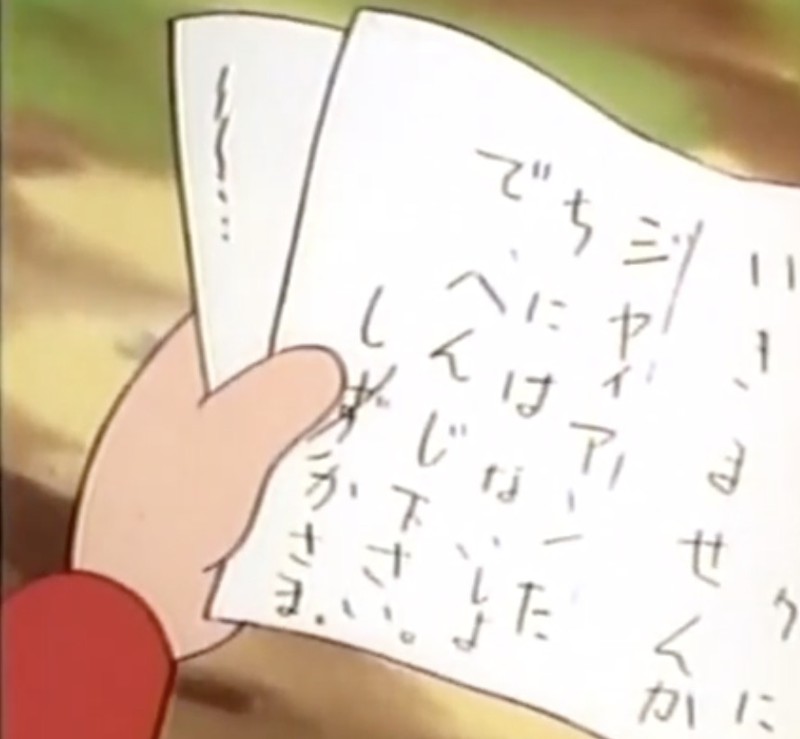
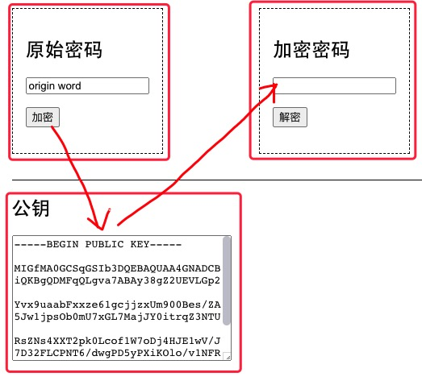
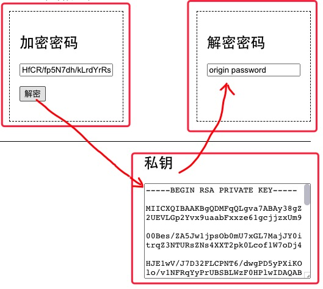

# 不对称加密rsa


《哆啦A梦》有一集叫《保密笔》


*野比大雄*给*源静香*写的信


在*刚田武*和*骨川小夫*看，什么都看不到


但是静香可以看到信的内容


动画中的内容，现实中早已实现


这个保密笔就是——**RSA**


我们现在可以写一个```I love you!```


然后用rsa加密成了别人看不懂的文字


```
FId8qJJfvrX3mTx3ap2+wEdo1+V1zonxvhaYZM51ClJD8+B15LkwhDhMSEZ/sfLZ1i+SunHl8InsVQ31LoLvSw5oJ4w6GcJWlmMD9Ax/iClGxaZEZl4IRmadcz7duGYbv6hllCaxLqdRGHJVwmwkGv1umL13PmUeP2DWmE9wMAY=
```


别人就跟小夫一样什么也看不到，但是拥有rsa的人可以看到```I love you!```



# RSA加密算法


RSA algorithm


RSA是1977年由罗纳德·李维斯特（Ron Rivest）、阿迪·萨莫尔（Adi Shamir）和伦纳德·阿德曼（Leonard Adleman）一起提出的。当时他们三人都在麻省理工学院工作。RSA就是他们三人姓氏开头字母拼在一起组成的


## 不对称加密


不对称加密算法使用两把完全不同但又是完全匹配的一对钥匙—公钥和私钥。在使用不对称加密算法加密文件时，只有使用匹配的一对公钥和私钥，才能完成对明文的加密和解密过程。


所以，给了公钥之后，谁都可以加密，谁都可以知道公钥。加密之后的内容，只有拥有私钥的才看得到。是不是真的好像哆啦A梦的保密笔


可以直接在线看我的demo——


https://thales-ucas.gitee.io/crypt/


1. 日常的app或者网页中，给前端一个公钥**publicKey**，前端根据这个key把原始密码**origin**加密成加密密码**encrypt**。





-----------


2. 后台接收这个加密后的密码**encrypt**，用一个只有自己知道的私钥**privateKey**来解密，得到跟**origin**一样的**decrypt**





比如用我的保密笔(rsa)写下了一句话，你可以在拥有我的私钥的页面中输入，看看解密之后是什么


加密后的内容如下——
```
FId8qJJfvrX3mTx3ap2+wEdo1+V1zonxvhaYZM51ClJD8+B15LkwhDhMSEZ/sfLZ1i+SunHl8InsVQ31LoLvSw5oJ4w6GcJWlmMD9Ax/iClGxaZEZl4IRmadcz7duGYbv6hllCaxLqdRGHJVwmwkGv1umL13PmUeP2DWmE9wMAY=
```


# 私钥和公钥的生成


可以在demo上尝试一下加密和解密过程，并且可以用后面的方法生成新的私钥公钥替换一下尝试


> 也就是创造你的“保密笔”


可是，怎么创建公钥私钥呢？


mac可以直接打开终端使用openssl，windows需要安装 https://www.openssl.org/


## 生成私钥


```bash
openssl genrsa -out chain_priv.pem
```


这样生成了一个 **chain_priv.pem** 的私钥文件


* genrsa 就是生成rsa的密钥
* out后面的就是你要生成的密钥名字


## 根据私钥生成公钥


```bash
openssl rsa -pubout -in chain_priv.pem -out chain_pub.pem
```


这样就生成了一个叫**chain_pub.pem**的公钥


* rsa 就是使用rsa的加密技术
* pubout就是public out，输出公钥
* in后面是根据的私钥
* out后面就是根据私钥生成的公钥

